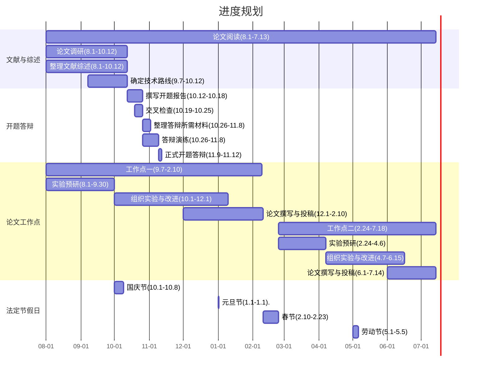

```mermaid
gantt
    title 进度规划
    dateFormat  YYYY-MM-DD
    axisFormat  %m-%d


    section 文献与综述
    论文阅读(8.1-7.13)         :t1, 2025-08-01, 2026-07-14
    论文调研(8.1-10.12)            :t2, 2025-08-01, 2025-10-12
    整理文献综述(8.1-10.12)          :t3, 2025-08-01, 2025-10-12
    确定技术路线(9.7-10.12)         :t3, 2025-09-07, 2025-10-12
 

    section 开题答辩
    撰写开题报告(10.12-10.18)          :k1, 2025-10-12, 2w
    交叉检查(10.19-10.25)             :k2, 2025-10-19, 1w
    整理答辩所需材料(10.26-11.8)       :k3, after k2, 1w
    答辩演练(10.26-11.8)              :k3, after k2, 2w
    正式开题答辩(11.9-11.12)           :k3, 2025-11-09, 3d

    section 论文工作点
   
    工作点一(9.7-2.10)        :w11, 2025-08-01, 2026-02-09
    实验预研(8.1-9.30):w110,2025-08-01,2025-10-01
    组织实验与改进(10.1-12.1):w111,2025-10-01,2026-01-10
    论文撰写与投稿(12.1-2.10):w112,2025-12-01,2026-02-10
    
    工作点二(2.24-7.18)        :w2, 2026-02-24, 20w
    实验预研(2.24-4.6):w20,2026-02-24,6w
    组织实验与改进(4.7-6.15):w21,after w20,10w
    论文撰写与投稿(6.1-7.14):w22,2026-06-01,2026-07-14

    section 法定节假日
    国庆节(10.1-10.8)               :holiday, 2025-10-01,8d
    元旦节(1.1-1.1).                :holiday, 2026-01-01,1d
    春节(2.10-2.23)              :holiday, 2026-02-10, 2w
    劳动节(5.1-5.5)                  :holiday, 2026-05-01,5d


```